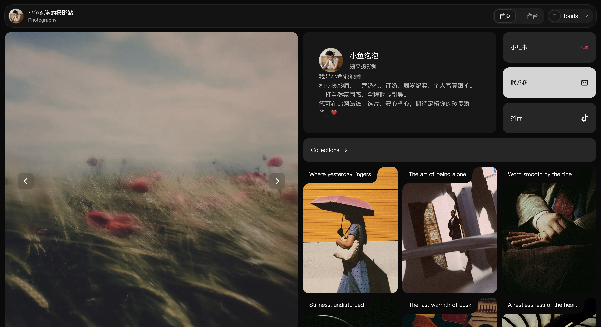
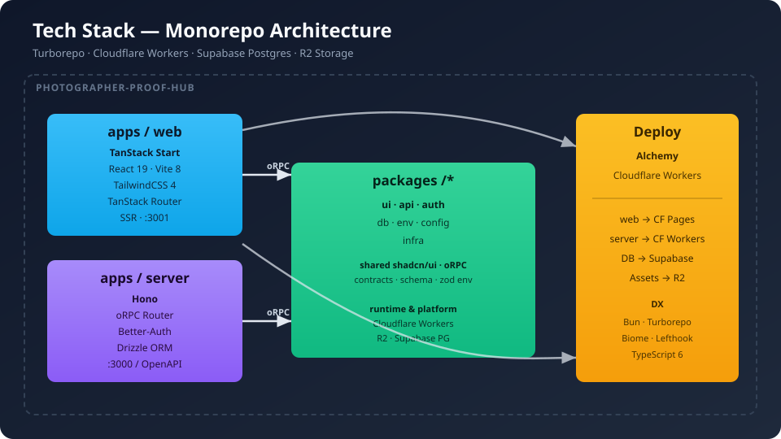

<p align="center">
  
</p>

<h1 align="center">Photographer Proof Hub</h1>

<p align="center">
  <strong>摄影师选片与作品展示平台</strong> — 独立摄影师的轻量级 Gallery 管理系统，支持安全分享、防截图水印与客户选片工作流
</p>

<p align="center">
  <a href="#tech-stack"></a>
  <a href="#tech-stack"></a>
  <a href="#tech-stack"></a>
  <a href="#tech-stack"></a>
  <a href="#tech-stack"></a>
  <a href="#tech-stack"></a>
  <a href="#tech-stack"></a>
  <a href="#tech-stack"></a>
  <a href="#tech-stack"></a>
  <a href="#tech-stack"></a>
  <a href="#tech-stack"></a>
  <a href="#tech-stack"></a>
  <a href="#tech-stack"></a>
</p>

---

## 核心能力

| 模块 | 说明 |
|------|------|
| **Gallery 管理** | 创建、编辑、归档相册；支持 Collections 分组与排序 |
| **照片上传** | 基于 Cloudflare R2 的图片存储，自动生成预览图 |
| **安全分享** | View Token 机制 + 防盗链 + 客户端防截图策略 |
| **水印系统** | 可配置文字/图片水印，客户端 Canvas 渲染 |
| **互动反馈** | 星级评分、评论功能，支持导出数据 |
| **SSR 前端** | TanStack Start 全栈渲染，首屏直出 |

## Tech Stack

<p align="center">
  
</p>

## 快速开始

> **前置要求**: [Bun](https://bun.sh/) >= 1.3, PostgreSQL 数据库

```bash
# 安装依赖
bun install

# 配置环境变量（数据库连接等）
cp apps/server/.env.example apps/server/.env

# 推送数据库 Schema
bun run db:push

# 启动开发服务
bun run dev
```

启动后：
- Web 前端 → `http://localhost:3001`
- API Server → `http://localhost:3000`
- OpenAPI 文档 → `http://localhost:3000/openapi`

## 项目结构

```
photographer-proof-hub/
├── apps/
│   ├── web/                  # SSR 前端 (TanStack Start + Vite)
│   │   ├── src/routes/       # 文件路由 (_auth, _guest, s/$slug)
│   │   └── src/components/   # 业务组件 (gallery-view, access-gate...)
│   └── server/               # 后端 API (Hono on Workers)
│       ├── src/routes/       # 路由 (image, upload, owner-image)
│       └── src/lib/          # R2 存储工具
├── packages/
│   ├── ui/                   # 共享 shadcn/ui 组件库
│   ├── api/                  # oRPC Router 定义 & 业务逻辑
│   ├── auth/                 # Better-Auth 配置
│   ├── db/                   # Drizzle Schema & Migration
│   ├── env/                  # 环境变量校验 (Zod)
│   ├── config/               # 共享 TSConfig
│   └── infra/                # Alchemy 部署配置
```

## 常用命令

| 命令 | 用途 |
|------|------|
| `bun run dev` | 启动全栈开发环境 |
| `bun run dev:web` | 仅启动前端 |
| `bun run dev:server` | 仅启动后端 |
| `bun run build` | 构建所有包 |
| `bun run check-types` | 全量类型检查 |
| `bun run check` | Biome lint + format |
| `bun run db:push` | 推送 Schema 到数据库 |
| `bun run db:studio` | 打开 Drizzle Studio |
| `bun run db:migrate` | 执行迁移 |
| `bun run deploy` | 部署到 Cloudflare (Alchemy) |

## 部署

项目使用 [Alchemy](https://alchemy.dev) 进行 Cloudflare Workers 一键部署：

```bash
# 登录并配置 Provider
cd packages/infra && bunx alchemy login --configure

# 开发预览
bun run dev

# 部署 (默认 dev stage)
bun run deploy

# 生产部署
cd packages/infra && bunx alchemy deploy --stage production
```

> [!NOTE]
> 首次部署后需在 `apps/server/.env` 中设置 `CORS_ORIGIN` 为实际域名。

## 开发规范

- **Lint / Format**: [Biome](https://biomejs.dev) — `bun run check` 自动修复
- **Git Hooks**: [Lefthook](https://github.com/evilmartians/lefthook) — pre-commit 自动格式化 staged 文件
- **UI 组件**: 共享组件位于 `packages/ui`，通过 shadcn CLI 扩展:
  ```bash
  npx shadcn@latest add <component> -c packages/ui
  ```
